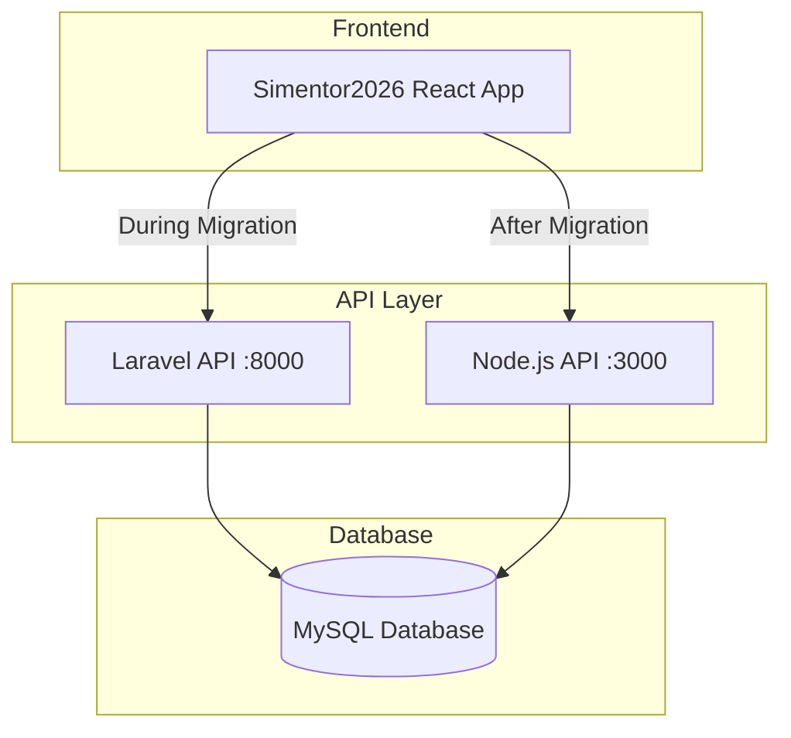

# Product Requirements Document: Laravel to Node.js API Migration

## Executive Summary

Migrate the Simentor3215 Laravel backend API to a Node.js (Fastify) application while maintaining **complete API compatibility**. The migration must ensure:

1. **Endpoint Parity** - All API routes exactly match Laravel structure
2. **Password Compatibility** - Users authenticated via Laravel bcrypt can login without password changes
3. **Response/Request Parity** - All JSON structures exactly match Laravel API responses

---

## Background & Context

The current backend is a Laravel application with:
- **76 database migrations** defining the schema
- **47 Eloquent models** handling data
- **415+ lines of API routes** in `api.php`
- **Laravel Sanctum** token-based authentication
- **Spatie Permission** for RBAC (roles/permissions)
- **Cursor-based pagination** with standardized response format

An existing Node.js API migration exists using **Fastify** with initial setup complete (see [existing documentation](file:///d:/Documents/GitHub/Simentor3215/backend/docs/plans/2025-12-28-laravel-to-nodejs-api-migration.md)).

---

## Critical Requirements

### 1. Authentication Compatibility

> [!IMPORTANT]
> Laravel uses PHP's `password_hash()` with bcrypt (cost 10-12). Node.js must verify these passwords using `bcrypt.compare()` against the same hash.

**Password Handling:**
```javascript
// Node.js verification of Laravel passwords
const bcrypt = require('bcrypt');
const isValid = await bcrypt.compare(plainPassword, laravelHashedPassword);
```

**Login Response Structure (must match exactly):**
```json
{
  "success": true,
  "message": "Login successful",
  "data": {
    "user": {
      "id": 1,
      "name": "Admin",
      "email": "admin@admin.com",
      "email_verified_at": null,
      "current_team_id": null,
      "profile_photo_path": null,
      "profile_photo_url": "https://...",
      "created_at": "2024-01-03T02:00:56.000000Z",
      "updated_at": "2024-12-02T18:29:58.000000Z"
    },
    "roles": [...],
    "permissions": [...],
    "token": "JWT_TOKEN_HERE"
  }
}
```

**Key Differences:**
| Laravel | Node.js |
|---------|---------|
| Sanctum Bearer Token | JWT Token |
| Token stored in `personal_access_tokens` table | Stateless JWT (client-side storage) |
| `Hash::check()` | `bcrypt.compare()` |

---

### 2. Response Structure Compatibility

All API responses must follow the Laravel `BaseApiController` pattern:

#### Success Response (Non-Paginated)
```json
{
  "success": true,
  "message": "Data retrieved successfully",
  "data": { ... }
}
```

#### Success Response (Paginated - Cursor-Based)
```json
{
  "success": true,
  "message": "Data retrieved successfully",
  "data": [...],
  "meta": {
    "per_page": 10,
    "has_more": true,
    "count": 10
  },
  "links": {
    "next_cursor": "eyJ...",
    "next_page_url": "http://api.example.com/api/endpoint?cursor=eyJ...",
    "prev_cursor": null,
    "prev_page_url": null,
    "path": "http://api.example.com/api/endpoint"
  },
  "pagination_info": {
    "total_page": 5,
    "total_records": 50
  }
}
```

#### Error Response
```json
{
  "success": false,
  "message": "Error description",
  "errors": { ... }  // Optional validation errors
}
```

---

### 3. Complete Endpoint Mapping

All API endpoints must be replicated with identical paths and HTTP methods:

#### Public Endpoints (No Auth Required)
| Method | Path | Description |
|--------|------|-------------|
| POST | `/api/login` | User login |
| GET | `/api/landing` | Landing page data |
| POST | `/api/kantor/tamu` | Guest registration |
| POST | `/api/kantor/pengaduan` | Complaint submission |
| GET | `/api/miniapp/surveycraft/file/{path}` | Survey file fetch |
| POST | `/api/miniapp/surveycraft/respond` | Survey response |
| GET | `/api/miniapp/surveycraft/share/{id}` | Share survey |

#### Protected Endpoints (Auth Required)

<details>
<summary><strong>Authentication & Profile (7 endpoints)</strong></summary>

| Method | Path |
|--------|------|
| POST | `/api/logout` |
| GET | `/api/profile` |
| PUT | `/api/profile` |
| PUT | `/api/profile/password` |
| GET | `/api/profile/pegawai` |
| PUT | `/api/profile/pegawai` |

</details>

<details>
<summary><strong>Admin Module (15 endpoints)</strong></summary>

| Method | Path |
|--------|------|
| GET | `/api/admin/roles` |
| GET | `/api/admin/roles/{id}` |
| POST | `/api/admin/roles` |
| PUT | `/api/admin/roles/{id}` |
| DELETE | `/api/admin/roles/{id}` |
| GET | `/api/admin/permissions` |
| GET | `/api/admin/permissions/form-options` |
| GET | `/api/admin/permissions/list-api-controllers` |
| GET | `/api/admin/permissions/{id}` |
| POST | `/api/admin/permissions` |
| PUT | `/api/admin/permissions/{id}` |
| DELETE | `/api/admin/permissions/{id}` |
| GET | `/api/admin/users` |
| GET | `/api/admin/users/organik` |
| GET | `/api/admin/users/mitra` |
| POST | `/api/admin/users` |
| GET | `/api/admin/users/{id}` |
| PUT | `/api/admin/users/{id}` |
| PUT | `/api/admin/users/{id}/permissions` |
| DELETE | `/api/admin/users/{id}` |
| POST | `/api/admin/users/bulk-update-roles` |

</details>

<details>
<summary><strong>Kantor Module (100+ endpoints)</strong></summary>

**Pegawai API:**
- GET/POST `/api/kantor/pegawai`
- GET `/api/kantor/pegawai/jabatan-pangkat-list`
- GET/PUT/DELETE `/api/kantor/pegawai/{id}`

**Setting API:**
- GET/POST `/api/kantor/settings`
- GET `/api/kantor/settings/grup-list`
- GET `/api/kantor/settings/officers`
- GET `/api/kantor/settings/key/{key}`
- GET/PUT/DELETE `/api/kantor/settings/{id}`

**Mitra API:**
- GET `/api/kantor/mitra`
- GET `/api/kantor/mitra/filters`
- GET `/api/kantor/mitra/penugasan-options`
- POST `/api/kantor/mitra/penugasan`

**Kegiatan API:**
- GET `/api/kantor/kegiatan`
- GET `/api/kantor/kegiatan/filter-list`
- GET `/api/kantor/kegiatan/calendar`
- GET `/api/kantor/kegiatan/form-options`
- GET `/api/kantor/kegiatan/by-year`
- GET `/api/kantor/kegiatan/statistics`
- GET/POST/PUT/DELETE `/api/kantor/kegiatan/{id}`

**Penugasan API:**
- GET `/api/kantor/penugasan`
- GET `/api/kantor/penugasan/mitra-dropdown`
- GET `/api/kantor/penugasan/mitra-options`
- GET `/api/kantor/penugasan/filters`
- GET `/api/kantor/penugasan/form-options`
- GET `/api/kantor/penugasan/kegiatan-options`
- GET/PUT/DELETE `/api/kantor/penugasan/{id}`
- POST `/api/kantor/penugasan/{id}/insert`

**Surat APIs (Permintaan, Keluar, Keputusan, Tugas, Detil):**
- Full CRUD for each surat type
- Special endpoints: `/dates`, `/years`, `/klasifikasi`, `/form-options`, `/sisip`

**SKP, SPK, BAST, Links, Tamu, Pengaduan, UU APIs:**
- Full CRUD operations for each module

</details>

<details>
<summary><strong>IPDS Module (Tikets, Assets)</strong></summary>

| Method | Path |
|--------|------|
| GET | `/api/ipds/tikets` |
| GET | `/api/ipds/tikets/keluhan-options` |
| POST | `/api/ipds/tikets` |
| GET/PUT/DELETE | `/api/ipds/tikets/{id}` |
| CRUD | `/api/ipds/assets` |
| CRUD | `/api/ipds/asset-it-maintenance-schedule` |

</details>

<details>
<summary><strong>Enums API (7 endpoints)</strong></summary>

| Method | Path |
|--------|------|
| GET | `/api/enums` |
| GET | `/api/enums/fungsi-types` |
| GET | `/api/enums/jabatan-tugas-types` |
| GET | `/api/enums/jenis-kegiatan-types` |
| GET | `/api/enums/satuan-types` |
| GET | `/api/enums/pangkat-types` |
| GET | `/api/enums/golongan-types` |
| GET | `/api/enums/jabatan-types` |

</details>

<details>
<summary><strong>Miniapp Module (Surveycraft)</strong></summary>

| Method | Path |
|--------|------|
| GET | `/api/miniapp/surveycraft` |
| POST | `/api/miniapp/surveycraft` |
| POST | `/api/miniapp/surveycraft/generate-ai` |
| GET | `/api/miniapp/surveycraft/options` |
| GET | `/api/miniapp/surveycraft/respond` |
| GET | `/api/miniapp/surveycraft/responds` |
| GET/POST/PUT/DELETE | `/api/miniapp/surveycraft/{id}` |

</details>

<details>
<summary><strong>PDF/DOCX Generation (6 endpoints)</strong></summary>

| Method | Path |
|--------|------|
| POST | `/api/spk/pdf/bulk-spks` |
| POST | `/api/spk/pdf/bulk-basts` |
| GET | `/api/surat/surat-tugas/generate-docx/gab/mitra/{id}` |
| GET | `/api/surat/surat-tugas/generate-docx/gab/organik/{id}` |
| GET | `/api/surat/surat-tugas/generate-docx/organik/{id}` |
| GET | `/api/surat/surat-tugas/generate-docx/satu/organik/{id}` |
| GET | `/api/surat/surat-keluar/generate-docx/{id}` |
| GET | `/api/surat/surat-keputusan/kpa/generate-docx/mitra/{sk}` |
| GET | `/api/surat/surat-keputusan/kpa/generate-docx/mitra/manual/{sk}` |
| GET | `/api/surat/surat-keputusan/kepala/generate-docx/organik/{sk}` |

</details>

---

### 4. Database Compatibility

The Node.js API must connect to the **same database** as Laravel using:
- MySQL2 for MySQL connections
- Same connection credentials from Laravel `.env`

**Key Tables:**
| Table | Purpose |
|-------|---------|
| `users` | User accounts (includes bcrypt password) |
| `personal_access_tokens` | Laravel Sanctum tokens (read-only for validation) |
| `roles` | Spatie roles |
| `permissions` | Spatie permissions |
| `model_has_roles` | User-Role assignments |
| `model_has_permissions` | User-Permission assignments |
| `pegawai` | Employee data |
| `mitra_kepka` | Partner data |
| `kegiatan` | Activities |
| `penugasan` | Assignments |
| `skp` | Performance documents |
| ... | (47 total models) |

---

### 5. Middleware & Security Compatibility

#### Rate Limiting
Match Laravel throttle settings:
| Endpoint | Limit |
|----------|-------|
| `/api/login` | 5 requests/minute |
| Public POST endpoints | 60 requests/minute |

#### CORS
Allow same origins as Laravel:
```javascript
{
  origin: true,
  credentials: true,
  methods: ['GET', 'POST', 'PUT', 'DELETE', 'PATCH', 'OPTIONS'],
  allowedHeaders: ['Content-Type', 'Authorization']
}
```

#### Hidden Fields
Ensure these fields are NEVER returned in responses:
- `password`
- `remember_token`
- `two_factor_recovery_codes`
- `two_factor_secret`

---

## Technical Architecture



**Parallel Operation Strategy:**
1. Both APIs run simultaneously during transition
2. Frontend can switch between APIs via environment variable
3. Node.js reads Laravel password hashes directly
4. JWT tokens (Node.js) are separate from Sanctum tokens (Laravel)

---

## Validation Requirements

### Request Validation

All request validation must match Laravel's validation rules. Example for login:

```javascript
// Must match Laravel validation
const validateLogin = {
  email: 'required|email',
  password: 'required|string'
};
```

For complex validations, use a library like `joi` or `ajv` with equivalent rules.

### Timestamps

All timestamps must be in ISO 8601 format matching Laravel:
```
2024-01-03T02:00:56.000000Z
```

---

## Implementation Phases

### Phase 1: Foundation
- [ ] Project setup with Fastify
- [ ] Database connection pool
- [ ] JWT plugin
- [ ] CORS configuration
- [ ] Base response utilities
- [ ] Create & Run Phase 1 Tests (Foundation)

### Phase 2: Authentication
- [ ] Login endpoint with bcrypt verification
- [ ] Logout endpoint
- [ ] Profile endpoints (show, update, updatePassword)
- [ ] Token refresh mechanism
- [ ] Create & Run Phase 2 Tests (Authentication)

### Phase 3: Admin Module
- [ ] Roles CRUD
- [ ] Permissions CRUD
- [ ] Users CRUD with role management
- [ ] Create & Run Phase 3 Tests (Admin)

### Phase 4: Kantor Module (Largest)
- [ ] Pegawai API
- [ ] Mitra API
- [ ] Kegiatan API
- [ ] Penugasan API
- [ ] Surat APIs (5 sub-modules)
- [ ] SKP, SPK, BAST APIs
- [ ] Links, Tamu, Pengaduan APIs
- [ ] Monitoring Kegiatan APIs
- [ ] Create & Run Phase 4 Tests (Kantor)

### Phase 5: Supporting Modules
- [ ] IPDS Module (Tikets, Assets)
- [ ] Enums API
- [ ] Miniapp Module (Surveycraft)
- [ ] PDF/DOCX Generation
- [ ] Create & Run Phase 5 Tests (Support)

### Phase 6: Verification
- [ ] Endpoint comparison testing
- [ ] Response structure validation
- [ ] Password compatibility testing
- [ ] Performance benchmarking

---

## Verification Plan

### Automated Testing

1. **Endpoint Comparison Script**
   - Compare Postman collection against implemented Node.js endpoints
   - Generate `ENDPOINT_COMPARISON.md` report
   - Run: `node scripts/compare-postman-nodejs.cjs`

2. **Response Structure Tests**
   - Validate JSON schema matches Laravel responses
   - Test pagination structure
   - Verify error response format

3. **Authentication Tests**
   - Verify bcrypt password validation
   - Test JWT token generation/verification
   - Validate role/permission checking

### Manual Testing

1. **Password Migration Test**
   - Login with existing Laravel user credentials
   - Verify no password reset required

2. **Frontend Integration Test**
   - Point React app to Node.js API
   - Test all major workflows

---

## Success Criteria

1. ✅ All Laravel API endpoints have Node.js equivalents
2. ✅ Existing Laravel users can login without password changes
3. ✅ All response structures match exactly
4. ✅ Pagination format is identical
5. ✅ Frontend works seamlessly with Node.js API
6. ✅ No data loss or corruption during parallel operation

---

## Resolved Decisions

> [!IMPORTANT]
> These decisions have been confirmed by the project owner:

### 1. Token Invalidation
**Decision:** No server-side JWT blacklist.
- Logout is handled client-side by deleting the token
- Simpler implementation, stateless architecture

### 2. File Uploads
**Decision:** Save to the same folder structure as Laravel.
- Example: SKP PDFs → `storage/app/skp/`
- Node.js must have write access to Laravel's storage folder
- Use `multer` or `@fastify/multipart` for handling uploads

### 3. Email Notifications
**Decision:** Not required. Laravel does not send emails that need migration.

### 4. Queue Jobs
**Decision:** Yes, migrate Google Drive upload job.
- Background job for uploading files to shared Google Drive
- Use `bull` or `bullmq` with Redis for job queue
- Replicate the same upload logic from Laravel

### 5. Caching Strategy
**Decision:** Use efficient caching with Redis.
- Recommended: `@fastify/caching` with Redis backend
- Cache frequently accessed data: enums, settings, pegawai lists
- Cache invalidation on write operations

---

## Related Documentation

- [Pagination Standard](file:///d:/Documents/GitHub/Simentor3215/backend/docs/pagination-standard.md)
- [Laravel API Routes](file:///d:/Documents/GitHub/Simentor3215/backend/routes/api.php)
- [Base API Controller](file:///d:/Documents/GitHub/Simentor3215/backend/app/Http/Controllers/Api/BaseApiController.php)
